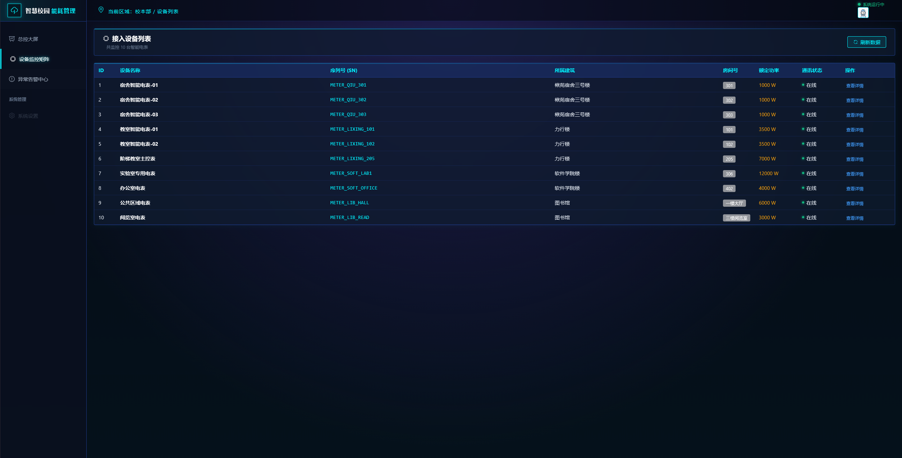
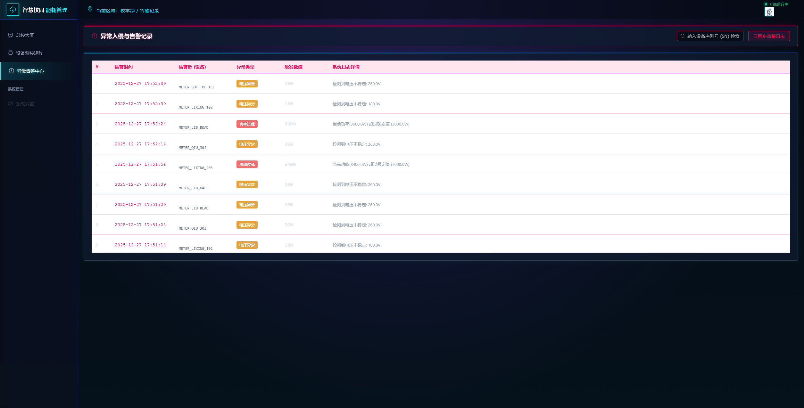

⚡ 智慧校园能耗监测与管理平台

基于 Spring Boot 3 + Vue 3 的全栈企业级能耗监控系统

项目简介

本项目针对校园能耗管理的痛点，设计了一套基于分层架构的监测系统。系统摒弃了传统的物理硬件依赖，通过后端高频模拟器生成符合物理规律（$P=UI$）的时序电能数据，并利用观察者模式实现毫秒级异常告警。前端采用ECharts实现全息风格的数据可视化大屏。

技术栈

后端: Spring Boot 3.0, JPA, MySQL 8.0, Lombok, Knife4j

前端: Vue 3, Element Plus, ECharts, Axios

设计模式:

策略模式 (Strategy): 处理日间/夜间/突刺等多种能耗生成算法。

观察者模式 (Observer): 解耦能耗生成与告警检测逻辑。

🚀 快速启动

1. 数据库配置

创建数据库 energy_20231120039，修改 application.properties 中的数据库账号密码。

2. 启动后端

运行 SmartCampusEnergyApplication.java。
系统启动后，DataInitRunner 会自动初始化 4 栋建筑和 10 台智能设备。

3. 访问系统

打开浏览器访问 http://localhost:8081 即可进入系统。
（前端已通过 Vite 打包集成至后端静态资源中）

📸 系统截图

Developed by 吴宇辰 | 2025秋软件设计期末项目